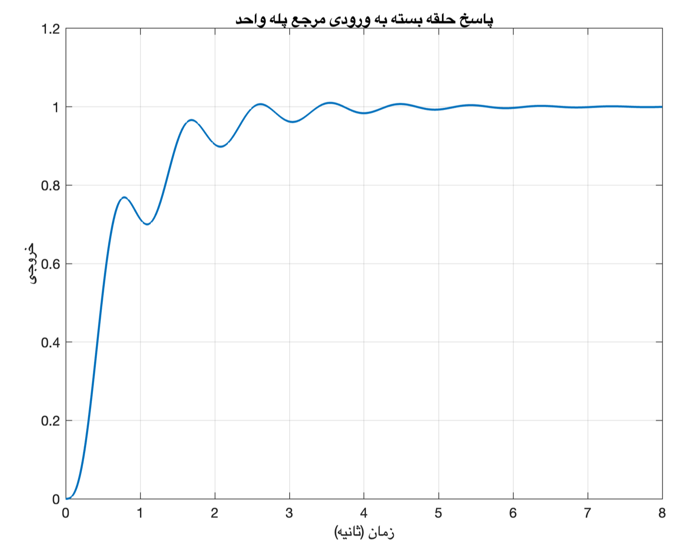
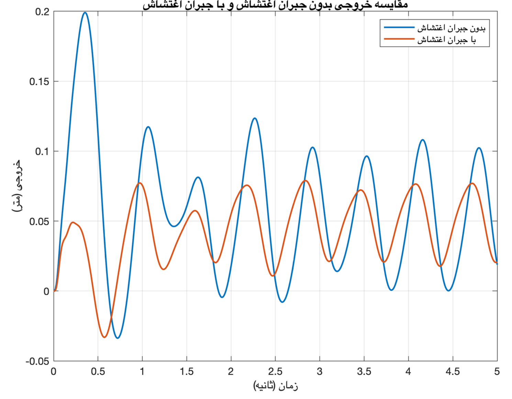
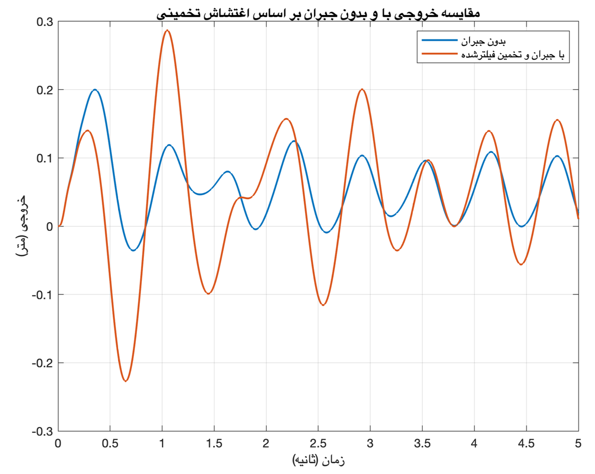
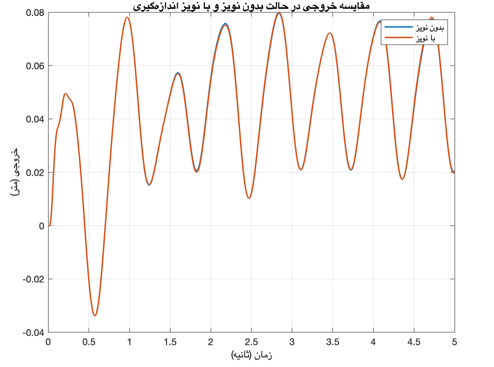

# LCS-active-suspension (Quarter‑Car Model)

Linear Control Systems course project.
PI control, disturbance feedforward & estimation, robustness analysis, and code generation for a quarter‑car active suspension.

## Overview

This repository contains all MATLAB scripts and functions developed for a university project on **active suspension systems**.  
The goal is to minimise the effect of road irregularities on the car body (ride comfort) using a feedback controller combined with a feed‑forward term that compensates the measured or estimated road profile.

The project follows a realistic workflow:

1. **Modelling** – state‑space model of a quarter‑car (body mass, wheel mass, springs, damper).
2. **Open‑loop analysis** – pole‑zero map, step responses, effect of the road disturbance.
3. **PI controller design** – meeting desired settling time and overshoot.
4. **Disturbance feedforward** – using the steady‑state gain \(K_d = -H(0)/G(0)\).
5. **Lag controller (optional)** – as an alternative to the PI.
6. **Disturbance estimation** – when the road profile is not measured directly: shadow model + low‑pass filter.
7. **Robustness tests** – measurement noise (–40 dB), ±5 % uncertainty in \(k_1\) and \(k_2\), and their combination.
8. **Code generation** – MATLAB Coder produces a MEX version of the controller; numerical equivalence is verified.

## Files

| File | Description |
|------|-------------|
| `main_LCSproj.m` | **Main script** – runs all sections (modelling, design, simulation, robustness, etc.) |
| `controller_step.m` | PI controller with anti‑windup (persistent integrator) |
| `controller_step_entry.m` | Entry point for code generation (calls `controller_step`) |
| `u_from_controller.m` | Helper: returns control signal \(u(t)\) for a given reference \(r(t)\) when disturbance is zero |
| `simulate_closedloop_estimated_disturbance.m` | Simulates closed‑loop with online disturbance estimation (shadow model + LPF) |
| `simulate_closedloop_meas_noise.m` | Simulates closed‑loop with measurement noise (and optional parameter uncertainty) |
| `closedloop_verify.m` | Verifies numerical equivalence between MATLAB and generated MEX code |
| `codegen_verify.m` | Simpler verification script for code generation |
| `LCS_ProjReport.pdf` | Full project report (Persian) – contains derivations, figures and detailed discussion |

##  Key Results

| Figure | Description |
|--------|-------------|
|  | **Closed‑loop step response** <br> PI controller (\(K_p=200, K_i=20000\)) achieves settling time ~3.25 s and overshoot ~1 %, matching the design specifications. |
|  | **Disturbance rejection** <br> Adding the feedforward gain \(K_d = -15000\) (orange) significantly reduces the low‑frequency road disturbance compared to the case without compensation (blue). |
|  | **Disturbance estimation** <br> When the road profile is not measured, a shadow model + low‑pass filter estimates it online. The output with estimated compensation (orange) still reduces the disturbance effectively, though high‑frequency residues remain. |
|  | **Measurement noise robustness** <br> Adding –40 dB white noise to the output measurement introduces ripple, but the controlled output (orange) remains stable and bounded – the controller shows acceptable robustness. |

> All figures are taken from the project report and correspond to the nominal system with the designed PI controller.

##  How to Run

1. Clone the repository and open MATLAB in that folder.
2. Run the main script:
   ```matlab
   main_LCSproj
